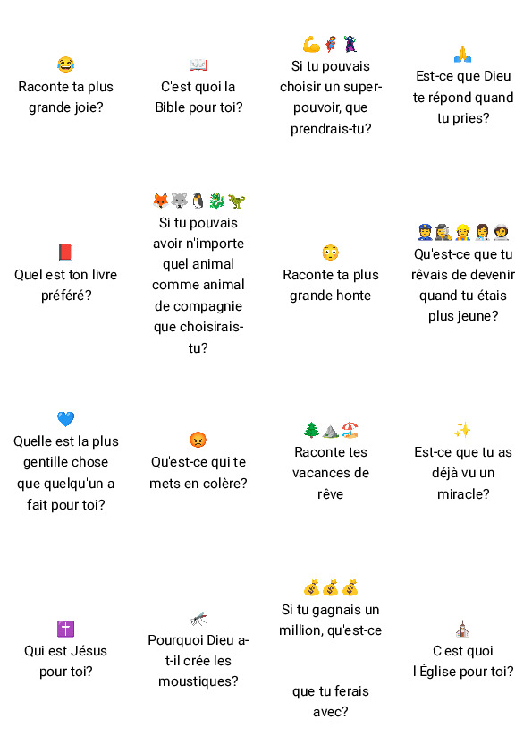

Un petit jeu de cartes pour faire connaissance dans le contexte d'un groupe d'enfants.

<!--more-->

| Meta              | Data                                                                   |
|-------------------|------------------------------------------------------------------------|
| Durée             | variable (min. 2mn par player)                                         |
| Nombre de joueurs | 5-20                                                                   |
| Objectifs         | <ul><li>Faire connaissance<li>Créer des occasions de partager la spiritualité</ul> |
| Public idéal      | Groupe d'enfants avec quelques accompagnant·e·s                        |
| Licence           | CC-BY-SA                                                               |

On a crée ce jeu pour faire connaissance au début d'un [camp d'enfants](https://www.eerv.ch/region/lausanne-epalinges/activites/enfance-et-familles/camps-centre-aere-weekend) de 6-8 ans il y a 2 ou 3 ans. L'idée était d'avoir un temps de brise-glace avec enfants et encadrants, pour partager des choses personnelles légères ou profondes, y compris des choses liées à la foi — mais sans mettre de pression.

## Règles

- Faire asseoir les participant·e·s en rond dans un endroit agréable et informel (par exemple dehors dans l'herbe)
- Mélanger les cartes et les placer au milieu
- À tour de rôle, chacun·e tire une carte, la lit à voix haute, et peut ensuite choisir:

    * d'y répondre: comme elle le souhaite, en prenant le temps voulu et en donnant les détails souhaités
    * de la donner à quelqu'un d'autre, qui peut faire de même — répondre, ou donner plus loin. La troisième fois que la carte est donnée, elle doit être donnée à un adulte/accompagnant·e/mono, qui *doit* y répondre.
- On continue ensuite avec la personne suivante…

## Matériel

- <a class="btn btn-primary" href="https://tools.open-source.church/wp-content/uploads/2022/05/IceBreaker-Kids-v1.0.pdf" target="_blank">PDF des cartes (v.1.0, 280Ko)</a>  
  À imprimer **sans marges** et couper en 16 (4 × 4).

- [Sources](https://gist.github.com/olivierkes/14a55d30f0a3abd9246e249e0c35bff2) (à utiliser avec [Fiat Ludux](https://fiatludux.open-source.church/))

## Modifier le jeu

Suivant le groupe, le contexte et/ou les personnes présentes, il peut-être utile d'enlever ou modifier certaines questions. En particulier les questions à portées spirituelles. Celles-ci avaient été choisies en parties en lien avec le thème du camp.

Pour modifier les cartes, vous pouvez utiliser [Fiat Ludux](https://fiatludux.open-source.church/), un générateur de cartes pour prototypage de jeu rapide. Le jeu est disponible dans les `Projets Open Source Church` à charger.

Partagez vos améliorations en retour !

>  Ce jeu est mis à disposition selon les termes de la <a rel="license" href="http://creativecommons.org/licenses/by-sa/4.0/">Licence Creative Commons Attribution -  Partage dans les Mêmes Conditions 4.0 International</a>.