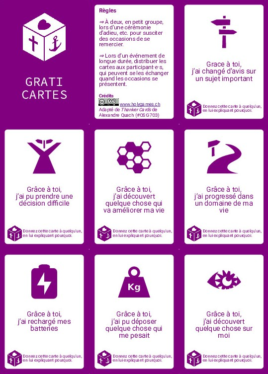

Un petit jeu de cartes à s'échanger pour s'entrainer à la gratitude.

À utiliser à 2, en petit groupe, pour honorer quelqu'un. Ou lors d'un évènement de longue durée, en donnant quelques cartes à chaque participant·e·s, à se donner quand les occasions se présentent.

<!--more-->

| Meta              | Data                                                                   |
|-------------------|------------------------------------------------------------------------|
| Nombre de joueurs | *                                                                   |
| Objectifs         | <ul><li>Apprendre à remercier de manière ciblée<li>Apprendre à recevoir des remerciements<li>Créer du lien dans un groupe</ul> |
| Public idéal      | Membres d'un groupe ou d'un évènements                        |
| Licence           | CC-BY-SA                                                               |
| Adapté de           | [Thanker Cards](https://openseriousgames.org/osg-703-thanker-cards/) de Alexandre Quach (#OSG 703)                                                               |

Nous avons crées ces cartes spécifiquement pour [holygames](https://www.holygames.ch): d'abord pour un weekend staff, puis nous avons commencé à les utiliser dans les weekends normaux.

## Règles

Les cartes peuvent s'utiliser de nombreuses manières, en voici quelques unes:

### Lors d'un évènement ouvert

- Distribuer à l'arrivée une carte au hasard à chaque participant·e
- En laisser une réserve quelque part d'accessible, pour pouvoir échanger sa carte ou aller en chercher une nouvelle
- Encourager à donner sa carte à quelqu'un d'autre quand l'occasion se présente, en expliquant pourquoi.
- Laisser les cartes circuler

### Dans un groupe qui se connait

Pendant un moment de célébration d'un groupe qui a cheminé ensemble, p.ex. une équipe qui collabore, un groupe de partage/prière, un couple, etc.

Par exemple:

- Étaler les cartes sur la table
- À tour de rôle, quelqu'un prend une carte pour la donner à quelqu'un d'autre en expliquant pourquoi

### Pour prier / développer une attitude de gratitude

- Prendre une carte (pas le droit de changer)
- Repenser à des situations spécifiques où la réalité décrite sur la carte a été vécue: quand, où, avec qui?
- Éventuellement: l'écrire, et/ou écrire un petit mot à la personne concernée (même si cela concerne un évènement d'il y a longtemps)

## Matériel

- <a class="btn btn-primary" href="https://tools.open-source.church/wp-content/uploads/2022/05/graticartes-holygames-v1.2.pdf" target="_blank">PDF des cartes (v.1.1, 167Ko)</a>  
  À imprimer recto et découper.

- [Sources](https://gist.github.com/olivierkes/244dddece608d67a3cb68226a915e91b) (à utiliser avec [Fiat Ludux](https://fiatludux.open-source.church/))

## Modifier le jeu

Le jeu a été développé pour un weekend de jeux, d'où certaines des cartes et illustrations. Suivant le contexte, il pourra être utile de modifier les questions, et/ou changer le thème (mais merci pour le petit coup de pub si vous utilisez le thème holygames ^^).

Pour modifier les cartes ou l'apparence, vous pouvez utiliser [Fiat Ludux](https://fiatludux.open-source.church/), un générateur de cartes pour prototypage de jeu rapide. Le jeu est disponible dans les `Projets Open Source Church` à charger.

Partagez vos améliorations en retour !

>  Ce jeu est mis à disposition selon les termes de la <a rel="license" href="http://creativecommons.org/licenses/by-sa/4.0/">Licence Creative Commons Attribution -  Partage dans les Mêmes Conditions 4.0 International</a>. Adapté de [Thanker Cards](https://openseriousgames.org/osg-703-thanker-cards/) de Alexandre Quach (#OSG 703)