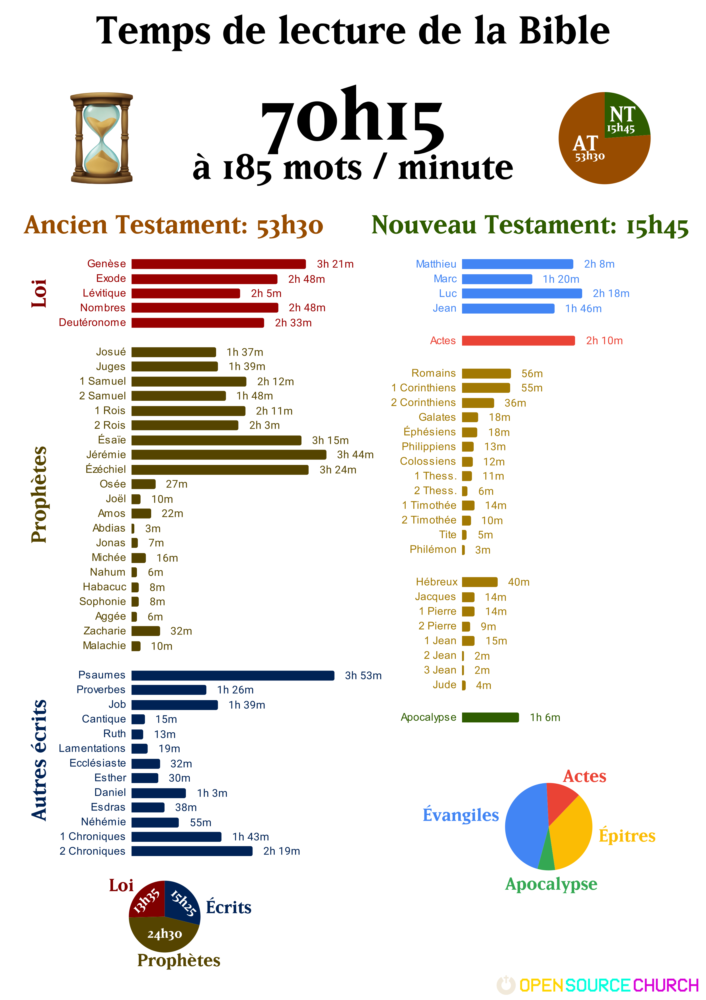

*Ce contenu a été préparé dans le cadre d'un camp du groupe de jeunes adultes ayant pour thème la Bible.*

**Remarques:**

* 185 mots par minutes correspond à une vitesse de lecture moyenne basse.
* Les temps de lectures ont été calculés sur la base de la traduction Segond 1910 (parce que libre de droit).
* Cela correspond à 12 minutes par jour en 1 an.  
* Fun Fact: 70h est le temps de visionnage intégral de la série *Game of Thrones*. Dans cette série, il y a aussi des dragons, des meurtres, du sexe et des morts vivants.  
* Fun Fact: 70h est aussi le temps moyen passé aux toilettes en une année. Cf:

