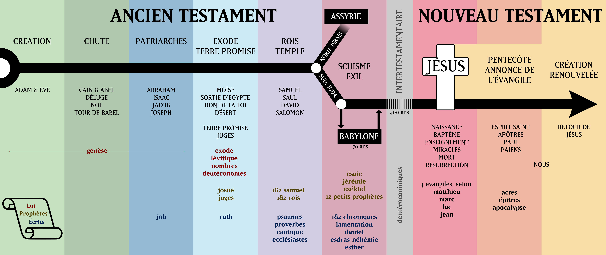

*Ce contenu a été préparé pour illustrer:*



**Remarques:**

* Les livres sont placés — plus ou moins — dans une perspective ***narrative* plutôt que *historique***. Ca veut dire qu'on s'intéresse plus ici à ce qu'ils racontent qu'au moment où ils ont été écrits. Mais c'est de toute façon plus complexe que ce qui en ressort dans une image.

  