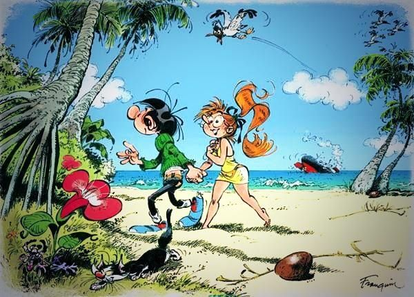
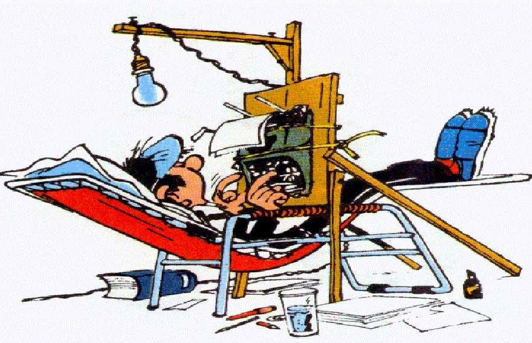

## Une question nous fut posée

Il y a un peu plus d’une année, notre cher ami Irockois a [écrit un billet sur ce blog](/2023/11/à-quel-personnage-de-fiction-tidentifies-tu/). Il nous expliquait les points communs qu’il avait avec Sheldon Cooper, et finissait par nous renvoyer la question : à quel personnage de fiction nous identifions-nous ?

Une question que j’ai pris plaisir à me poser, même si, a priori, aucun personnage ne me faisait tilt. Jusqu’à ce que je pense à quelqu’un, et là, ce fut presque une évidence…

Inutile de faire durer le suspense plus longtemps : au vu du titre de ce billet, vous l’aurez peut-être compris, ce personnage c’est Gaston Lagaffe.

## C’est qui Lagaffe ?

Vous n’êtes peut-être pas familier ou familière avec notre cher ami Gaston, alors laissez-moi vous le présenter.

Gaston Lagaffe est le protagoniste d’une bande dessinée humoristique, qui met en scène la vie de ce jeune adulte accumulant bévues et boulettes, en particulier sur son lieu de travail.

Un personnage qui semble a priori assez simple. Et pourtant, je pense que Gaston Lagaffe a bien plus de relief qu’on ne pourrait l’imaginer, et je vais essayer de vous le prouver !

## Le Gaffeur

Commençons par le commencement. Gaffeur. C’est la caractéristique la plus évidente de ce personnage, celle dont est tiré son nom, celle sur laquelle repose le ressort comique de la bande dessinée.

Et il se trouve que c’est un premier point où je m’identifie, car je me considère comme assez maladroite. Déjà physiquement : je ne compte plus le nombre d’assiettes que j’ai cassées, d’objets que j’ai cognés et d’agendas que j’ai déchirés. Mais aussi relationnellement : même si j’ai une certaine sensibilité qui me permet d’avoir de l’empathie pour les gens, je mets assez régulièrement les pieds dans le plat, avec une franchise pas toujours bienvenue.

Comme Gaston, j’ai le sentiment qu’au contact des choses et des gens, il y aura des fêlures, des éclaboussures, des bognes et des taches.

## L’ami et l’amoureux

Mais comme Gaston, je sais qu’à leur contact, il y aura aussi beaucoup d’amour. Car Lagaffe fait preuve d’une grande tendresse. Déjà envers son amoureuse, Mademoiselle Jeanne, avec qui il est particulièrement attentionné. Mais aussi avec ses amis, Jules-de-chez-Smith-en-face et Labevue, à qui il remonte parfois le moral. Et il éprouve même une certaine sympathie envers ses collègues, malgré leur relation tendue.

Car s’il y a bien une chose que l’on trouve très rarement chez ce personnage, c’est de la méchanceté pure et simple.

## Le créatif …

Enfin, comment parler de Gaston Lagaffe sans mentionner sa créativité débordante ? Au fil des bandes-dessinées il ne cesse d’inventer des objets farfelus, de se livrer à des expériences douteuses, de détourner des outils de leurs fonction de base pour les utiliser de manière parfaitement improbable. Son imagination ne semble jamais connaitre de limite. 

Je ne suis personnellement pas très manuelle, contrairement à lui. Mais il est vrai que j’ai toujours des idées qui me tournent en tête, des choses à tester, des listes à créer, des histoires à conter. Et si nos inventions semblent assez éloignées, elles ont pourtant un point en commun…

## …aux inventions infructueuses

…elles semblent systématiquement inutiles. Du moins, dans le sens qu’elles ne favorisent pas une certaine productivité. 

Eh oui, qu’on parle d’une machine à fabriquer des avions en papier ou la capacité à finir en puzzle en moins d’une heure, on peut s’accorder sur le fait que c’est assez peu exploitable dans la vie de tous les jours. Qu’on le veuille ou non, cette créativité ne peut pas être transformée en ressource utilisable dans le monde du travail. Moi je sais juste que j’ai beau essayer, ça ne fonctionne pas. Certains y verront un inconvénient majeur, d’autres, [une certaine beauté dans cette inefficacité](/2023/06/et-si-on-se-permettait-derrer/). 

## Le point de divergence

Et elle est peut-être là, la plus grande différence entre ce personnage et moi. Gaston Lagaffe accepte pleinement qui il est, il n’essaie pas de changer, pas de s’adapter. Il reste fidèle à lui-même, envers et contre tout. Bien sûr c’est aidé par le fait qu’il soit un personnage de bande dessinée (il se serait fait viré des centaines de fois dans la vraie vie).

Néanmoins, je ne peux m’empêcher de m’émouvoir devant une telle authenticité. Devant la résilience dont il fait preuve face à un contexte qui ne lui convient pas du tout. A sa manière d’utiliser sa créativité pour ne pas laisser l’ennui l’aliéner. 

## Gaffeuse, moi ?

Alors, je suis une gaffeuse moi ? Oui. Tout autant que je suis une rêveuse et une amoureuse.

Et j’espère qu’un jour, comme Gaston,	que ce soit à coup de tier liste ou au doux son du gaffophone, je me frayerais mon propre chemin dans ce monde.