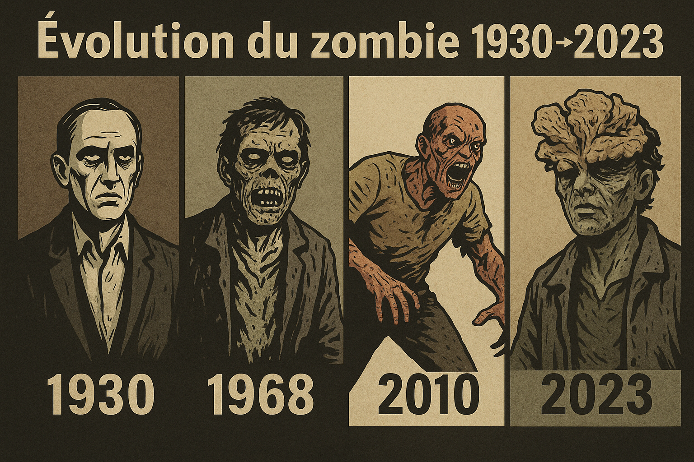
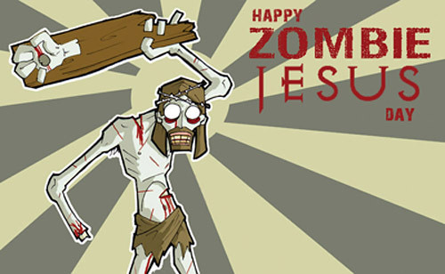

# Quand l’humanité a inventé le zombie
*(De Haïti à la science moderne)*

## Introduction

Imagine un cercueil, sous terre, avec un corps immobile à l’intérieur.
La terre est lourde, tout est silencieux. Puis, soudain, un grattement.
Une main jaillit, les ongles arrachés par l’effort. **Le mort est de retour.**

C’est une image universelle, qu’on retrouve partout dans les histoires de zombies.
Mais d’où vient cette idée ? Est-ce seulement une invention fictionnelle, ou est-ce que la science peut nous offrir une explication, même partielle ?

Depuis près d’un siècle, le zombie est passé des croyances vaudou d’Haïti aux blockbusters hollywoodiens, jusqu’aux séries Netflix.
Toujours la même peur : **perdre notre humanité, devenir un corps qui marche sans volonté.**

Et aujourd’hui, certains chercheurs se posent même une question vertigineuse :
pourrait-il exister une version scientifique, une maladie ou un parasite, qui transformerait vraiment les vivants en “zombies” ?

---

## Contexte simple — Qu’est-ce qu’un zombie ?

Avant d’aller plus loin, il faut clarifier ce qu’on entend par zombie.
Dans l’imaginaire collectif, on mélange plusieurs figures.

---

### Le ressuscité

Le zombie classique, celui qu’on imagine sortir d’un tombeau, c’est le **ressuscité**.
Un cadavre qui reprend vie sans raison naturelle, souvent vide de conscience, parfois même en état de décomposition.
C’est la version la plus “gothique”, celle des cimetières et des films en noir et blanc.

Le *ressuscité* est une **marionnette sans esprit**, ramenée artificiellement.
Par exemple, la nécromancie — qui signifie littéralement *“divination par les morts”* — est une magie sombre qu’on retrouve dans de nombreux univers de fantasy, où un sorcier fait revenir les cadavres pour en faire ses serviteurs.

---

### L’infecté

À côté, il y a le **zombie infecté**. Celui-là n’est pas mort.
C’est un vivant dont le comportement a été modifié par une maladie, un virus ou un parasite.
Ses mouvements sont désordonnés, son regard vide, et il devient agressif, souvent au point de mordre.
C’est la version moderne, qu’on retrouve dans la plupart des films et jeux récents.

L’*infecté* est un **humain piraté**, dont le cerveau et le comportement ont été détournés et souvent dégradés par une force extérieure.
On peut penser aux histoires modernes où un virus transforme ses victimes en silhouettes errantes et agressives, un peu comme si la personne avait été “reprogrammée” contre sa volonté.

---

Ces deux images vont se mélanger dans la suite de l’histoire.
Mais ce qu’elles ont en commun, c’est une peur fondamentale : **perdre le contrôle de notre corps, et voir les morts revenir occuper la place des vivants.**

---

## Histoire — Origines haïtiennes et vaudou

Bien avant Hollywood, le zombie existait déjà. Pas sous la forme de hordes sanguinaires, mais comme une figure enracinée dans la culture haïtienne et dans le vaudou.

En créole, *zonbi* désigne un être humain privé de volonté. Dans les croyances, c’est souvent un malheureux dont l’âme a été capturée par un **bokor**, un prêtre vaudou pratiquant la magie.
Le corps continue de bouger, mais il n’appartient plus à la personne. Le zombie devient une sorte d’esclave éternel, condamné à travailler sans repos.

---

### Le zombie, symbole de l’esclavage

Ce détail est capital : le mythe haïtien du zombie ne parle pas seulement de morts qui marchent.
Il parle surtout d’une peur très concrète : **l’esclavage**.

Haïti a été marqué par des siècles de colonisation, de traite et de servitude, jusqu’à la fin du XVIIIᵉ siècle, où éclate la seule révolte d’esclaves réussie de l’histoire moderne.
Le zombie, c’est l’image ultime de l’humain dépossédé de lui-même, réduit à un corps sans liberté.

---

### L’affaire Clairvius Narcisse

Un cas réel a particulièrement marqué les esprits : celui de ***Clairvius Narcisse***.

En 1962, cet homme est déclaré mort dans un hôpital haïtien. Enterré, il réapparaît **18 ans plus tard** dans son village, affirmant avoir été transformé en zombie par un bokor.

Les chercheurs qui ont étudié son histoire ont parlé d’une possible intoxication à base de substances naturelles, capables d’induire un état de catalepsie — une sorte de coma profond où la personne semble morte.

---

### Wade Davis et les poudres zombies

L’ethnobotaniste ***Wade Davis***, dans les années 1980, enquête sur ces *poudres zombies*.

Il avance l’hypothèse que certains bokors utilisaient un mélange de toxines, dont la tétrodotoxine (présente dans le poisson fugu, un poisson-globe particulièrement dangereux car il contient l’un des poisons naturels les plus puissants au monde), pour plonger des victimes dans cet état de mort apparente.

Si l’explication scientifique reste débattue, l’histoire a frappé l’imagination et renforcé le lien entre zombies et vaudou.

---

### L’arrivée en Occident

Mais avant même les recherches de Davis, le mot *zombie* fait son entrée dans la culture occidentale dès la fin des années 1920, avec le livre *The Magic Island* de ***William Seabrook***.

Dans ce récit, il raconte ses voyages en Haïti et décrit la figure du zombie telle qu’il la découvre sur place.

Quelques années plus tard, en 1932, le cinéma s’en empare avec *White Zombie* de ***Victor Halperin***, considéré comme le premier film de zombies.
Ces créatures n’y sont pas des monstres mangeurs de chair, mais bel et bien des esclaves sans volonté, manipulés par un sorcier, un bokor.

---

C’est cette racine haïtienne qui constitue le premier chapitre du mythe.
Le zombie y est moins une menace de contagion qu’une métaphore de la perte d’identité et de liberté.
Un symbole qui allait, très vite, se transformer au contact d’Hollywood et des angoisses du monde moderne.

---

## Pop Culture — La grande mutation

Si le zombie est né à Haïti, c’est à Hollywood qu’il s’est transformé en icône mondiale.

Tout change en 1968, quand ***George A. Romero*** sort *La Nuit des morts-vivants*.
Ses créatures n’ont plus rien à voir avec les esclaves du vaudou.
Ce sont des morts qui se relèvent, qui avancent lentement mais sans jamais s’arrêter, et qui dévorent les vivants.
Vous l’aurez compris : **Romero invente presque à lui seul le zombie moderne.**

---

### Les zombies de Romero

Ce film devient un tournant culturel. Les zombies de Romero ne sont pas seulement des monstres.
Ils sont un miroir des angoisses de leur époque.

Dans les années 1970 et 80, on les retrouve comme critique de la société de consommation (*Zombie* / *Dawn of the Dead*), ou comme métaphore des tensions raciales et politiques.
Derrière la chair en décomposition, Romero parle des humains, pas seulement des créatures.

---

### Les infectés rapides

Puis la figure du zombie s’accélère.
En 2002, *28 Days Later* de ***Danny Boyle*** réinvente le mythe avec des infectés rapides, pris de rage.
Le rythme change : on n’est plus dans la lente marche inexorable, mais dans la panique brutale d’une épidémie fulgurante.

Les jeux vidéo prennent le relais avec *Resident Evil*, où la peur se mélange à la science et aux laboratoires.
Le zombie devient produit de la recherche, victime d’expériences et de virus trafiqués.

---

### Les zombies du petit écran

Les années 2010 voient l’apocalypse zombie envahir les séries.

*The Walking Dead* transforme le mort-vivant en toile de fond pour raconter autre chose : la survie, les conflits humains, la fragilité de nos sociétés.
Les zombies sont là, mais ce sont surtout les vivants qui s’entredéchirent.

Bien que cadavérique, le zombie y perd presque son rôle de “monstre” face à la brutalité et la violence humaine.

---

### Le champignon de *The Last of Us*

Enfin, avec *The Last of Us*, le zombie change encore de visage.
Cette fois, ce n’est pas un virus mais un champignon, inspiré du cordyceps qui parasite les fourmis.

La créature n’est plus seulement un cadavre ambulant, mais une fusion troublante d’humain et de nature, moitié homme moitié mycélium.

Et si l’idée paraît tirée par les cheveux, elle trouve pourtant un écho dans la réalité : **même la RTS a récemment consacré un article aux champignons parasites et à la menace croissante qu’ils représentent pour l'humanité et la nature.**

---

### Aujourd’hui

La figure est partout : cinéma, jeux, romans, séries, mèmes internet.

On a des zombies lents, rapides, grotesques, dramatiques.
On a même des zombies comiques.

Mais ce qu’ils gardent tous en commun, c’est l’idée qu’on ne peut pas leur échapper : tôt ou tard, ils finissent toujours par nous atteindre.

---

---

## Le détour par *Zombie Jésus*

Quand on parle de morts qui reviennent à la vie, il y a toujours un moment où une question surgit : **et Jésus, dans tout ça ?**

Chaque année à Pâques, internet s’amuse à détourner l’image de la résurrection en parlant de *“Zombie Jésus”*.
On trouve des mèmes, des blagues, et parfois même des débats sérieux.

Derrière l’humour, ça montre surtout à quel point notre époque associe automatiquement le mot “résurrection” à celui de “zombie”.

---

### Un passage troublant de Matthieu

Un passage de l’Évangile selon Matthieu alimente encore plus ce parallèle.
Au chapitre 27, il est écrit qu’*“après la résurrection de Jésus, les tombeaux s’ouvrirent et plusieurs saints ressuscités apparurent à un grand nombre de personnes”*.

Pour un lecteur moderne, difficile de ne pas imaginer la scène comme une invasion : des tombes qui s’ouvrent, des morts qui sortent et marchent dans les rues de Jérusalem.

---

### Ce que disent les théologiens

Pourtant, les théologiens rappellent que la comparaison ne tient pas.

***Jason VonWachenfeldt***, dans *TheoFantastique* (un blog spécialisé qui explore les liens entre religion et culture populaire), insiste : un zombie est une coquille vide, un corps sans esprit.

La résurrection chrétienne affirme exactement l’inverse.
Jésus ne revient pas comme un cadavre animé, mais avec un corps transformé, glorieux, bien réel.
Dans les récits, il marche, parle, mange avec ses disciples.
C’est un corps, mais un corps porteur de vie, pas de mort.

***Melissa Fain***, dans *Fig Tree Christian* (un site de méditations et réflexions chrétiennes), le formule autrement : Jésus n’est pas mort-vivant au sens des films d’horreur.
Il est présenté comme vivant, conscient, porteur d’un message.

Le réduire à une comparaison avec un zombie, c’est passer à côté de ce que la résurrection signifie pour les croyants : **l’espérance d’une vie éternelle, où le corps lui-même est restauré.**

---

### Le décalage moderne

Ce qui reste fascinant, c’est le décalage.

Là où les premiers chrétiens voyaient un signe d’espoir, nos cerveaux modernes, nourris de films de Romero ou de séries comme *The Walking Dead*, imaginent des morts-vivants.

Au fond, comparer Jésus à un zombie n’apprend rien sur le christianisme.
Mais ça dit beaucoup sur nous : **aujourd’hui, dès qu’on entend parler de morts qui se relèvent, on pense aussitôt aux zombies.**

---

## Tordre la science — Pourquoi les morts ne sortent pas

Dans les films, un zombie sort souvent de son cercueil comme si de rien n’était.
En réalité, la biologie ferme complètement cette porte.

Quand un corps meurt, tout s’arrête.
Le cerveau, privé d’oxygène, subit des dommages irréversibles au bout de quelques minutes seulement.
Les cellules commencent à se décomposer. Les muscles se figent, puis se relâchent.
Le cœur ne bat plus, la circulation s’arrête.
Bref, rien ne peut “redémarrer” par magie.

---

### Des illusions troublantes

Et pourtant, au fil des siècles, certains détails ont alimenté l’imaginaire.

- Quand un cadavre se décompose, des gaz s’accumulent dans l’abdomen.
  Ils font gonfler le ventre, poussent l’air hors des poumons, et peuvent produire un râle.
  Imagine trouver un corps qui semble “soupirer” alors qu’il est mort depuis des heures.

- Il y a aussi la **rigidité cadavérique**. Après la mort, les muscles se durcissent, puis finissent par se relâcher.
  Résultat : un bras qui semblait figé peut retomber soudainement, comme si le mort avait bougé.

- Ajoute à ça quelques spasmes nerveux résiduels… et tu comprends comment naissent les légendes.

---

### Les erreurs médicales

Avant la médecine moderne, les erreurs de diagnostic étaient fréquentes.

Certaines maladies ou poisons pouvaient plonger quelqu’un dans un état de catalepsie : respiration et pouls presque imperceptibles, corps immobile.

Pour un médecin du Moyen Âge, c’était la mort.
Cette confusion peut expliquer une partie des histoires d’**enterrés vivants**.

Et quand, par miracle, quelqu’un se “réveillait” dans son cercueil, la panique suffisait à faire naître des rumeurs de résurrection.

---

### Le rôle des cimetières

Même les cimetières ont nourri ces croyances.

Avec le temps, le sol s’affaisse, des cercueils se déplacent, parfois des corps réapparaissent après une inondation.
Pour qui assiste à ça sans explication scientifique, c’est facile d’imaginer que les morts **essaient de sortir**.

---

### Pourquoi on y a cru

En résumé, aucun cadavre ne peut revenir marcher.
Mais entre les bruits, les mouvements involontaires, les erreurs médicales et les phénomènes naturels, tout était réuni pour alimenter un imaginaire où la frontière entre vie et mort semblait moins nette qu’on le croit.

---

## Scénarios plausibles — Si ça devait exister

Si on met de côté l’idée du cadavre qui gratte sa tombe, il reste un terrain bien plus crédible : celui des vivants transformés.
Pas besoin de magie, juste des microbes, des virus ou des parasites capables de bouleverser notre comportement.

Voyons trois pistes.

---

### La rage mutée

La rage existe déjà.
C’est une maladie virale transmise par morsure, qui finit par attaquer le cerveau.
Les malades deviennent confus, hallucinent, parfois agressifs.
Rien qu’avec ça, on a déjà une base réaliste pour le mythe.

---

#### Le problème de la lenteur

Entre la morsure et les premiers symptômes, il peut s’écouler des semaines.
Et une fois déclarée, la maladie tue trop vite pour se propager à grande échelle.

#### Imaginons une version différente

Une rage fulgurante, qui se déclenche en quelques heures.
Non plus limitée aux morsures, mais transmissible par la salive, une toux, une goutte de sang.

Le malade devient aussitôt violent, incapable de reconnaître ses proches, et attaque tout ce qui bouge.

C’est exactement ce qu’avait imaginé *28 Days Later*, où un virus de la “rage” transformait ses victimes en assaillants incontrôlables.
Même *The Walking Dead* s’appuie sur une idée voisine, en évoquant une corruption du système nerveux qui pousse les infectés à une agressivité pure, comme si l’instinct de survie avait été détourné.

#### Les limites du corps humain

Mais le corps humain a ses limites.
En mode adrénaline permanente, le cœur et les organes lâcheraient vite.

Un infecté “zombie” ne survivrait probablement que deux ou trois jours, moins encore s’il était fragile.
On aurait donc une vague de chaos brève mais brutale.

---

**Tableau comparatif : Rage actuelle vs Rage zombie**

| Caractéristique       | Rage actuelle (réelle)             | Rage "zombie" (hypothétique)           |
|------------------------|------------------------------------|----------------------------------------|
| Incubation            | Semaines à plusieurs mois          | Quelques heures à 2 jours              |
| Transmission          | Morsure                           | Salive, toux, gouttelettes, morsure    |
| Symptômes             | Confusion, agitation, hydrophobie  | Agressivité immédiate, perte de contrôle |
| Durée de vie infecté  | Quelques jours après symptômes     | 2–3 jours max (effondrement cardiaque) |
| Impact social         | Cas isolés, progression lente      | Chaos violent, flambée fulgurante      |

---

### Le cauchemar des champignons

Dans la jungle, il existe un parasite qui fait frissonner rien qu’à le décrire.
Le *Ophiocordyceps unilateralis* — ou Cordyceps — est un champignon qui infecte une fourmi, la force à grimper le long d’une tige, puis la tue en libérant une tige de spores qui perce son crâne.
C’est réel, et c’est déjà digne d’un film d’horreur.

Mais transposer ça à l’humain est presque impossible.
Notre température est trop élevée pour lui, nos cerveaux bien trop complexes.
Pour piloter une fourmi, c’est comme conduire une petite voiture.
Pour manipuler un humain, ce serait comme piloter un avion de ligne avec une manette de jeu.

#### Des barrières qui bougent

Et pourtant, le climat change.
Certains champignons s’adaptent à des températures plus hautes.

On a vu apparaître la *Candida auris*, une levure redoutable capable de résister à la chaleur (elle survit au-delà de 40 °C) et insensible à la majorité des traitements antifongiques.
Elle ne transforme pas les gens en marionnettes, mais elle montre que les barrières peuvent se déplacer.

Un cordyceps humain façon *The Last of Us* reste très improbable.
Mais dans une version plus plausible, on pourrait imaginer des champignons capables de provoquer :
- des crises neurologiques,
- des troubles cognitifs,
- voire des comportements désorientés.

Pas de créatures mi-humaines mi-mycelium, mais des personnes perdues, errantes, rendues imprévisibles.

#### Une menace déjà réelle

Et surtout, il ne faut pas oublier que les champignons sont déjà une menace sérieuse.
L’OMS estime qu’ils causent plusieurs millions de morts chaque année (environ 3,8 millions), principalement chez les personnes immunodéprimées.

Des espèces comme *Candida auris* ou *Aspergillus* résistent déjà à nos traitements.
Alors si certaines s’adaptaient encore davantage, l’idée d’une “apocalypse fongique” n’aurait plus rien de purement fictif.

---

**Tableau comparatif : Cordyceps réel vs Cordyceps humain hypothétique**

| Caractéristique       | Cordyceps réel (fourmis)           | Cordyceps humain hypothétique            |
|------------------------|------------------------------------|------------------------------------------|
| Hôte                  | Insectes (fourmis, cigales, etc.)  | Humains fragiles (immunodéprimés, âgés)  |
| Température tolérée   | 20–25 °C                           | Adaptation possible à 37 °C              |
| Action sur l’hôte     | Manipule des comportements simples | Provoque confusion, crises neurologiques |
| Vitesse d’action      | Quelques jours                     | Lente (jours à semaines)                 |
| Résultat visible      | Tige qui sort du cadavre           | Troubles cognitifs, pas de mutations     |
| Probabilité           | Déjà réel                          | Très faible, mais pas impossible         |

---

## Conclusion

Le zombie, au fond, n’est pas qu’une histoire de virus ou de cadavres. Depuis Haïti jusqu’aux blockbusters, il parle surtout d’une peur universelle : perdre ce qui fait de nous des humains. Que ce soit l’esclavage qui hante la mémoire haïtienne, ou l’idée moderne de devenir une coquille vide contrôlée par une force extérieure, c’est toujours la même angoisse qui revient... celle d’être déshumanisé.

Alors, vrai ou pas, le zombie reste un miroir. Il nous force à nous demander : qu’est-ce qui pourrait nous transformer en corps sans volonté ? La réponse n’est peut-être pas seulement dans les microbes, mais aussi dans nos sociétés elles-mêmes.

---

## Questions pour vous

- Lequel de ces scénarios vous semble le plus crédible : la rage mutée, le champignon adapté ou le parasite manipulateur ?
- Pensez-vous que notre société serait capable de résister à une telle infection, ou plongerait-elle immédiatement dans le chaos ?
- Une apocalypse courte et brutale est-elle plus effrayante qu’un effondrement lent et progressif ?
- Et si la plus grande menace n’était pas les morts qui se relèvent… mais des vivants qui changent sans en avoir conscience ?
- De quoi la zombification est-elle un symbole pour vous : boulot-métro-dodo, réseaux sociaux, perte de liberté ?

---

## Références bibliographiques

### Origines culturelles, vaudou et pop culture
- Davis, E.W. (1983). *The Ethnobiology of the Haitian Zombi*. Journal of Ethnopharmacology.
  [https://doi.org/10.1016/0378-8741(83)90029-6](https://doi.org/10.1016/0378-8741(83)90029-6)
- Davis, W. (1988). *Passage of Darkness: The Ethnobiology of the Haitian Zombie*. University of North Carolina Press.
  [https://archive.org/details/passageofdarknes0000davi](https://archive.org/details/passageofdarknes0000davi)
- Albuquerque, U.P. et al. (2012). *Natural Products from Ethnodirected Studies: Revisiting the Ethnobiology of the Zombie Poison*. Evid Based Complement Alternat Med.
  [https://pmc.ncbi.nlm.nih.gov/articles/PMC3184504/](https://pmc.ncbi.nlm.nih.gov/articles/PMC3184504/)
- Hurbon, L. (1993). *Les mystères du vaudou*. Gallimard.
- Hoermann, R. (2017). *Figures of terror: The “zombie” and the Haitian Revolution*. University of Central Lancashire.
  [https://clok.uclan.ac.uk/id/eprint/16036/](https://clok.uclan.ac.uk/id/eprint/16036/)
- Seabrook, W. (1929). *The Magic Island*. (Texte qui a popularisé les zombies en Occident).
  [https://en.wikipedia.org/wiki/The_Magic_Island](https://en.wikipedia.org/wiki/The_Magic_Island)
- Article : *Du vaudou haïtien à la pop culture, comment les zombies ont envahi le monde*. Le Monde (31 octobre 2023).
  [https://www.lemonde.fr/le-monde-des-religions/article/2023/10/31/du-vaudou-haitien-a-la-pop-culture-comment-les-zombies-ont-envahi-le-monde_6197558_6038514.html](https://www.lemonde.fr/le-monde-des-religions/article/2023/10/31/du-vaudou-haitien-a-la-pop-culture-comment-les-zombies-ont-envahi-le-monde_6197558_6038514.html)

---

### Zombie jésus

- ***Melissa Fain***, *Zombie Jesus: God is Not Undead*, Fig Tree Christian
  [https://www.figtreechristian.org/meditations/zombie-jesus-god-is-not-undead](https://www.figtreechristian.org/meditations/zombie-jesus-god-is-not-undead)

- ***Jason VonWachenfeldt***, *Catholic Theologian Rejects “Zombie Jesus”*, TheoFantastique
  [https://www.theofantastique.com/2010/12/27/catholic-theologian-rejects-zombie-jesus/](https://www.theofantastique.com/2010/12/27/catholic-theologian-rejects-zombie-jesus/)

- ***Matthew 27:52-53***, *The Holy Bible* (traductions diverses, ex. Louis Segond)

- ***Backyard Theology***, *Are those Zombies in Matthew 27:53?*, Medium
  [https://medium.com/backyard-theology/are-those-zombies-in-matthew-27-53-8d6eccac8007](https://medium.com/backyard-theology/are-those-zombies-in-matthew-27-53-8d6eccac8007)

---

### Sciences forensiques et “morts qui sortent de leur tombe”
- StatPearls. (2023). *Postmortem Changes*. NCBI Bookshelf.
  [https://www.ncbi.nlm.nih.gov/books/NBK539901/](https://www.ncbi.nlm.nih.gov/books/NBK539901/)
- Britannica. *Death: Changes in the body after death*.
  [https://www.britannica.com/science/death/Changes-in-the-body-after-death](https://www.britannica.com/science/death/Changes-in-the-body-after-death)
- Smithsonian Magazine. (2012). *The Science of Rotting Corpses*.
  [https://www.smithsonianmag.com/science-nature/the-science-of-rotting-corpses-30817034/](https://www.smithsonianmag.com/science-nature/the-science-of-rotting-corpses-30817034/)

---

### Rage et virologie
- Institut Pasteur. *Rage — Fiche maladie*.
  [https://www.pasteur.fr/fr/centre-medical/fiches-maladies/rage](https://www.pasteur.fr/fr/centre-medical/fiches-maladies/rage)
- Canada.ca. *Rage : Symptômes et traitement*.
  [https://www.canada.ca/fr/sante-publique/services/maladies/rage.html](https://www.canada.ca/fr/sante-publique/services/maladies/rage.html)
- WHO. *Fiche d’information sur la rage*.
  [https://www.who.int/fr/news-room/fact-sheets/detail/rabies](https://www.who.int/fr/news-room/fact-sheets/detail/rabies)
- Singh, R. et al. (2017). *Rabies – epidemiology, pathogenesis, public health*. Pathogens and Global Health.
  [https://doi.org/10.1080/20477724.2017.1343516](https://doi.org/10.1080/20477724.2017.1343516)
- Brookes, V.J. et al. (2019). *Rabies-induced behavioural changes are key to explaining persistence*. PLoS Negl Trop Dis.
  [https://pmc.ncbi.nlm.nih.gov/articles/PMC6776358/](https://pmc.ncbi.nlm.nih.gov/articles/PMC6776358/)
- Nature Reviews Disease Primers. (2017). *Rabies*.
  [https://www.nature.com/articles/nrdp201791](https://www.nature.com/articles/nrdp201791)
- Arsuaga, M. et al. (2024). *Rabies: Epidemiological update and prevention*. One Health Advances.
  [https://doi.org/10.1016/j.onehlt.2024.100304](https://doi.org/10.1016/j.onehlt.2024.100304)
- Mfano, C. et al. (2024). *Mathematical model of rabies transmission dynamics*. arXiv.
  [https://arxiv.org/abs/2406.15447](https://arxiv.org/abs/2406.15447)

---

### Cordyceps et champignons “zombies”
- RTS. *Les champignons de l'apocalypse*.
  [https://www.rts.ch/info/sciences-tech/2025/article/champignons-parasites-une-menace-croissante-pour-l-homme-et-la-nature-28985296.html](https://www.rts.ch/info/sciences-tech/2025/article/champignons-parasites-une-menace-croissante-pour-l-homme-et-la-nature-28985296.html)
- Wikipedia. *Ophiocordyceps unilateralis*.
  [https://en.wikipedia.org/wiki/Ophiocordyceps_unilateralis](https://en.wikipedia.org/wiki/Ophiocordyceps_unilateralis)
- Evans, H.C. et al. (2011). *Ophiocordyceps unilateralis: a keystone species…*. PLoS ONE.
  [https://pmc.ncbi.nlm.nih.gov/articles/PMC3204140/](https://pmc.ncbi.nlm.nih.gov/articles/PMC3204140/)
- de Bekker, C. et al. (2014). *Species-specific ant brain manipulation by a fungal parasite*. BMC Evolutionary Biology.
  [https://bmcecolevol.biomedcentral.com/articles/10.1186/s12862-014-0166-3](https://bmcecolevol.biomedcentral.com/articles/10.1186/s12862-014-0166-3)
- Araújo, J.P.M. et al. (2018). *Zombie-ant fungi across continents: 15 new species…*. PLoS ONE.
  [https://pmc.ncbi.nlm.nih.gov/articles/PMC6002356/](https://pmc.ncbi.nlm.nih.gov/articles/PMC6002356/)

---

### Champignons thermotolérants & climat
- WHO. *Candida auris – Fact sheet*.
  [https://www.who.int/news-room/fact-sheets/detail/candida-auris](https://www.who.int/news-room/fact-sheets/detail/candida-auris)
- Du, H. et al. (2020). *Candida auris: Epidemiology, biology, antifungal resistance*. PLoS Pathog.
  [https://journals.plos.org/plospathogens/article?id=10.1371/journal.ppat.1008921](https://journals.plos.org/plospathogens/article?id=10.1371/journal.ppat.1008921)
- Casadevall, A. et al. (2021). *Environmental Candida auris and the global warming emergence hypothesis*. mBio.
  [https://pmc.ncbi.nlm.nih.gov/articles/PMC8092241/](https://pmc.ncbi.nlm.nih.gov/articles/PMC8092241/)
- Jara, M. et al. (2025). *Genomic Dynamics of the Emergent Candida auris*. Open Forum Infect Dis.
  [https://academic.oup.com/ofid/advance-article/doi/10.1093/ofid/ofaf441/8215866](https://academic.oup.com/ofid/advance-article/doi/10.1093/ofid/ofaf441/8215866)
- Money, N.P. et al. (2024). *Fungal thermotolerance revisited and climate change*. Fungal Biology Reviews.
  [https://doi.org/10.1016/j.fbr.2024.01.001](https://doi.org/10.1016/j.fbr.2024.01.001)
