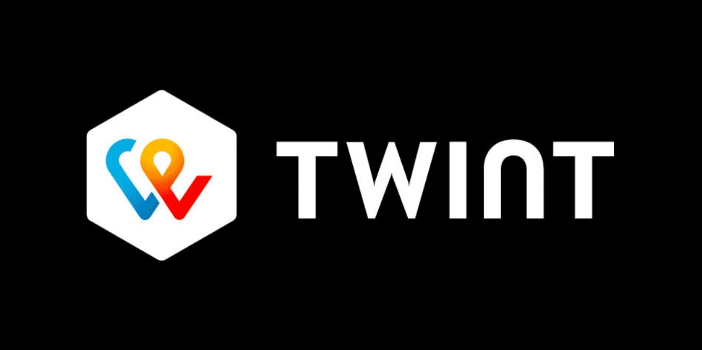
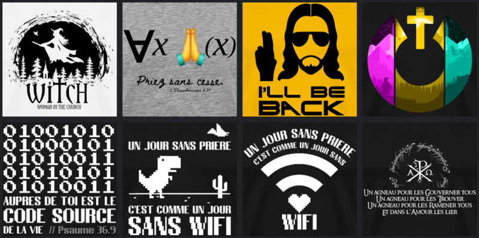

## Nous avons besoin de vous pour rendre cette aventure possible !

Grâce à vos dons, OSC peut accomplir sa mission de créer une communauté chrétienne inclusive par et pour des geeks.

<!--

L'argent est utilisé pour:

- Créer des activités et permettre à des personnes en situation de précarité de participer
- Défraier et engager des collaborateurs et collaboratrices
- Achater du matériel

-->

<a class="m-3 col-8 col-md-4 btn btn-primary" href="#voici-différentes-manières-de-soutenir-financièrement-open-source-church">Faire un don unique</a>
<a class="m-3 col-8 col-md-4 btn btn-primary" href="#sengager-à-soutenir-osc-de-manière-régulière">Faire un don régulier</a>

### Voici différentes manières de soutenir financièrement Open Source Church.

<!--

  
1200

-->

<!--

- title: PayPal
  image: paypal.jpg
  summary: "Faire un don ponctuel ou récurrent."
  buttons: [["PayPal", "https://www.paypal.com/donate?token=Xw_TahVb3s2O8XjO0spZGmcw22WN1Pwd86zV-B3kQz_QFrIwqDJ0GxlA88Jg7sltyQUlhXyqH4RiRI8c", "paypal"]]

-->

  

    <article class="card bg-dark rounded-0 border-bottom border-primary border-top-0 border-left-0 border-right-0 hover-shadow">
    
    

        <h4 class="card-title"><a href="#">TWINT</a></h4>
        
Faire un don avec TWINT

        <a href="twint-qr.png" class="btn btn-primary btn-sm venobox" style="display:none;"> TWINT</a>
        <a href="#twintform" class="btn btn-primary btn-sm venobox" data-vbtype="inline" data-maxwidth="500px"> TWINT</a>
        

          

            <h3>Coordonnées bancaires</h3>
            

            
          

        

    

    </article>
  

  

    <article class="card bg-dark rounded-0 border-bottom border-primary border-top-0 border-left-0 border-right-0 hover-shadow">
    
    

        <h4 class="card-title"><a href="#">IBAN</a></h4>
        
Faire un versement bancaire

        <a href="bv.jpg" class="btn btn-primary btn-sm venobox"> BV</a>
        <a class="btn btn-primary btn-sm venobox" data-vbtype="inline" data-maxwidth="500px" href="#inline-content"> Info</a>
        

          

            <h3>Coordonnées bancaires</h3>
            
            CH40 0839 0040 5385 1000 1   
            Open Source Church    
            Avenue de Chailly 52    
            1012 Lausanne
            
          

        

    

    </article>
  

  

    <article class="card bg-dark rounded-0 border-bottom border-primary border-top-0 border-left-0 border-right-0 hover-shadow">
    
    

        <h4 class="card-title"><a href="#">Shop OSC</a></h4>
        
T-shirts, mugs et goodies.

        <a href="https://opensourcechurch.myspreadshop.ch/" class="btn btn-primary btn-sm" target="_blank"> Shop ↪</a>
    

    </article>
  

  

    <article class="card bg-dark rounded-0 border-bottom border-primary border-top-0 border-left-0 border-right-0 hover-shadow">
    
    

        <h4 class="card-title"><a href="#">Twitch</a></h4>
        
Achetez / offrez un abonnement.

        <a href="https://www.twitch.tv/opensourcechurch" class="btn btn-primary btn-sm" target="_blank"> Twitch ↪</a>
    

    </article>
  

### S'engager à soutenir OSC de manière régulière

Afin de péréniser le développement d'OSC, nous recherchons dans l'idéal des donateurs réguliers, mensuels ou annuels.

**Objectif:** 20 promesses de dons

  

    2 / 20 (10%)
  

<iframe class="mt-5" src="https://framaforms.org/je-mengage-a-donner-pour-osc-1694167126" width="100%" height="800" border="0"></iframe>